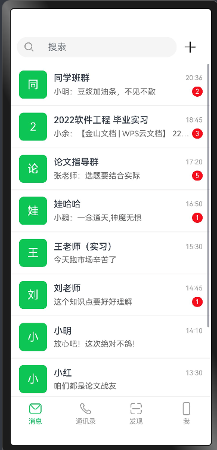

# 鸿蒙聊天APP - 代码使用说明





## 快速开始指南

### 一、导入代码到 DevEco Studio

1. **打开 DevEco Studio**，选择 `File` → `Open` 或直接启动时选择"打开项目"
2. **创建新的鸿蒙项目**（如果还没有）：
    - 选择 `Empty Ability` 模板
    - API Version 选择 **API 9** 或更高版本
    - 语言选择 **ArkTS**
3. **复制页面文件**：
    - 将 `harmonyos_pages` 文件夹中的所有 `.ets` 文件
    - 复制到项目的 `entry/src/main/ets/pages/` 目录下
4. **配置路由**：
    - 打开 `entry/src/main/resources/base/profile/main_pages.json`
    - 添加所有页面路径到 `src` 数组中

### 二、配置 main_pages.json

在 `entry/src/main/resources/base/profile/main_pages.json` 中添加：

```json
{
  "src": [
    "pages/SplashPage",
    "pages/LoginPage",
    "pages/RegisterPage",
    "pages/MessageListPage",
    "pages/ChatDetailPage",
    "pages/ContactsPage",
    "pages/DiscoverPage",
    "pages/ProfilePage",
    "pages/ContactDetailPage",
    "pages/AddFriendPage",
    "pages/NewFriendPage",
    "pages/GroupListPage",
    "pages/SettingsPage",
    "pages/AccountSecurityPage",
    "pages/PrivacySettingsPage",
    "pages/NotificationSettingsPage",
    "pages/AboutPage",
    "pages/CreateGroupPage",
    "pages/GroupDetailPage",
    "pages/SearchMessagePage",
    "pages/ImagePreviewPage",
    "pages/MomentsDetailPage",
    "pages/PublishMomentPage",
    "pages/EditProfilePage"
  ]
}
```

### 三、准备资源文件

在 `entry/src/main/resources/base/media/` 目录下需要准备以下图片资源：

**必需图标**：
- `app_icon.png` - 应用图标
- `default_avatar.png` - 默认头像
- `default_image.png` - 默认图片
- `default_group_avatar.png` - 默认群头像
- `tab_message.png` - 消息图标
- `tab_contacts.png` - 通讯录图标
- `tab_discover.png` - 发现图标
- `tab_profile.png` - 我的图标
- `icon_*.png` - 各种功能图标

**提示**：如果缺少资源文件，可以使用系统自带图标 `$r('sys.media.ohos_ic_public_*')` 替代。

### 四、运行预览

1. **连接设备**：
    - 启动 HarmonyOS 模拟器（推荐使用 API 9 或更高版本）
    - 或连接支持 HarmonyOS 的真机设备
2. **构建项目**：
    - 点击工具栏的 `Build` → `Build Hap(s)/APP(s)`
    - 等待依赖下载和编译完成
3. **运行应用**：
    - 点击工具栏的绿色"运行"按钮（▶）
    - 选择目标设备
    - 应用将自动安装并启动
4. **预览页面**：
    - 应用启动后会显示启动页（SplashPage）
    - 3秒后自动跳转到登录页
    - 可以通过导航测试所有24个页面

### 五、页面导航路径

| 序号 | 页面名称 | 文件名 | 入口路径 |
|------|----------|--------|----------|
| 1 | 启动页 |SplashPage.ets | 应用启动入口 |
| 2 | 登录页 |LoginPage.ets | 启动页自动跳转 |
| 3 | 注册页 |RegisterPage.ets | 登录页 → 立即注册 |
| 4 | 消息列表 |MessageListPage.ets | 登录后主页 |
| 5 | 聊天详情 |ChatDetailPage.ets | 消息列表 → 点击会话 |
| 6 | 通讯录 |ContactsPage.ets | 底部导航 → 通讯录 |
| 7 | 发现 |DiscoverPage.ets | 底部导航 → 发现 |
| 8 | 个人中心 |ProfilePage.ets | 底部导航 → 我 |
| 9 | 联系人详情 |ContactDetailPage.ets | 通讯录 → 点击联系人 |
| 10 | 添加好友 | AddFriendPage.ets | 通讯录 → 右上角+ |
| 11 | 新朋友 | NewFriendPage.ets | 通讯录 → 新的朋友 |
| 12 | 群聊列表 | GroupListPage.ets | 通讯录 → 群聊 |
| 13 | 设置 | SettingsPage.ets | 个人中心 → 设置 |
| 14 | 账号安全 | AccountSecurityPage.ets | 设置 → 账号与安全 |
| 15 | 隐私设置 | PrivacySettingsPage.ets | 设置 → 隐私 |
| 16 | 通知设置 | NotificationSettingsPage.ets | 设置 → 新消息通知 |
| 17 | 关于 | AboutPage.ets | 设置 → 关于微信 |
| 18 | 创建群聊 | CreateGroupPage.ets | 群聊列表 → 右上角+ |
| 19 | 群聊详情 | GroupDetailPage.ets | 群聊列表 → 点击群聊 |
| 20 | 搜索消息 | SearchMessagePage.ets | 消息列表 → 搜索框 |
| 21 | 图片预览 | ImagePreviewPage.ets | 聊天详情 → 点击图片 |
| 22 | 朋友圈 | MomentsDetailPage.ets | 发现 → 朋友圈 |
| 23 | 发布动态 | PublishMomentPage.ets | 朋友圈 → 相机图标 |
| 24 | 编辑资料 | EditProfilePage.ets | 个人中心 → 点击头像 |

### 六、注意事项

1. **API 版本要求**：
    - 最低支持 HarmonyOS API 9
    - DevEco Studio 版本建议 4.0 及以上

2. **缺失资源处理**：
    - 如果编译报错提示资源不存在，可以暂时注释相关 Image 组件
    - 或使用系统图标替代：`$r('sys.media.ohos_ic_public_*')`

3. **首次运行**：
    - 首次构建会下载依赖，请保持网络畅通
    - 编译时间较长，请耐心等待

4. **模拟器选择**：
    - 推荐使用 Phone 设备模拟器
    - 屏幕分辨率建议 1080x2340 或以上

5. **功能说明**：
    - 所有页面均为静态展示，数据为模拟数据
    - 网络请求、数据库存储等功能需要另外实现
    - 页面间的数据传递需要使用路由参数

### 七、常见问题解决

**Q1: 编译报错 "Cannot find module 'router'"**
```typescript
// 在文件顶部添加
import router from '@ohos.router'
```

**Q2: 图片资源找不到**
```typescript
// 方案1：使用占位文本
Text('图片')
  .width(50)
  .height(50)
  .backgroundColor('#F5F5F5')

// 方案2：使用系统图标
Image($r('sys.media.ohos_ic_public_contacts'))
```

**Q3: 页面跳转失败**
- 检查 `main_pages.json` 中是否已添加目标页面路径
- 确保路径格式正确：`pages/PageName`（不含 .ets 后缀）

**Q4: 底部导航切换异常**
- 当前实现为简单跳转，建议使用 Tabs 组件重构
- 或使用 router.replaceUrl 替代 pushUrl

### 八、后续开发建议

1. **数据管理**：使用 AppStorage 或 LocalStorage 管理全局状态
2. **网络请求**：集成 @ohos.net.http 实现真实数据交互
3. **本地存储**：使用关系型数据库存储聊天记录
4. **多媒体**：集成相机、相册、录音等功能
5. **推送通知**：接入消息推送服务

---

## 联系支持

如有问题，请参考：
- [HarmonyOS 开发者文档](https://developer.harmonyos.com/)
- [DevEco Studio 使用指南](https://developer.harmonyos.com/cn/develop/deveco-studio)

**开发完成日期**：2025年10月21日
**页面总数**：24个
**代码总行数**：约6000行

